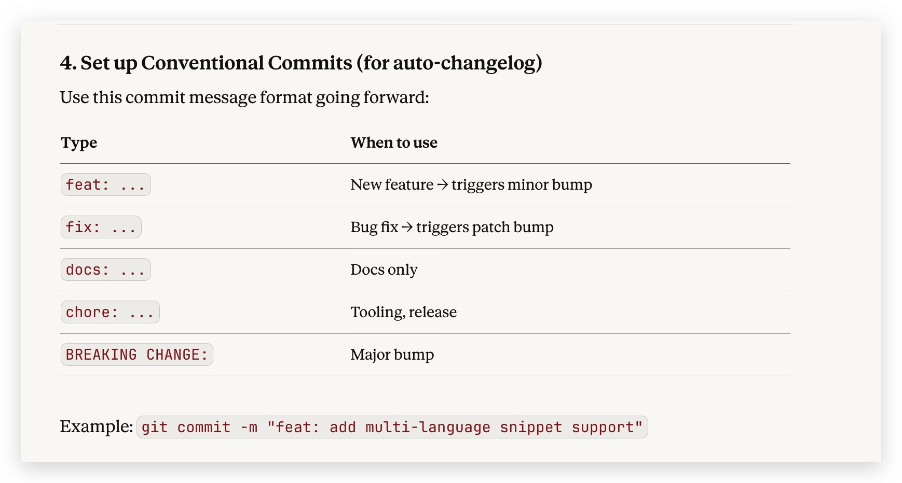

# Publishing Guide — Quick Snippet Generator

A complete step-by-step guide to publish this extension to the VS Code Marketplace.

---

## Prerequisites

- Node.js 16+ installed → https://nodejs.org
- A Microsoft account → https://account.microsoft.com
- A GitHub account (for repository link)

---

## Step 1 — Install vsce

```bash
npm install -g @vscode/vsce
```

Verify it works:

```bash
vsce --version
```

---

## Step 2 — Create a Microsoft Azure Personal Access Token (PAT)

1. Go to https://dev.azure.com and sign in with your Microsoft account
2. Click your **profile icon** (top right) → **Personal access tokens**
3. Click **+ New Token**
4. Configure:
    - **Name**: `vsce-publish` (or anything)
    - **Organization**: `All accessible organizations`
    - **Expiration**: 1 year recommended
    - **Scopes**: Click **Custom defined** → check **Marketplace → Manage**
5. Click **Create**
6. **Copy the token immediately** — you cannot view it again

---

## Step 3 — Create a Publisher on the Marketplace

1. Go to https://marketplace.visualstudio.com/manage
2. Sign in with the same Microsoft account
3. Click **Create publisher**
4. Fill in:
    - **Publisher ID**: e.g. `yourname-dev` (lowercase, hyphens ok, no spaces) — this is permanent
    - **Display Name**: e.g. `Your Name`
5. Click **Create**

---

## Step 4 — Update package.json

Open `package.json` and replace the placeholder values:

```json
{
  "publisher": "yourname-dev",         ← your Publisher ID from Step 3
  "author": { "name": "Your Name" },   ← your real name
  "repository": {
    "url": "https://github.com/YOUR-USERNAME/quick-snippet-generator"
  }
}
```

Also update `LICENSE` — replace `Your Name` with your real name.

---

## Step 5 — Replace the Icon

The file `images/icon.png` is a placeholder. Replace it with your own **128x128 PNG** icon before publishing.

- Must be exactly **128x128 pixels**
- PNG format
- Will appear on the Marketplace listing

---

## Step 6 — Install Dependencies

```bash
cd quick-snippet-generator
npm install
```

---

## Step 7 — Login to vsce

```bash
vsce login yourname-dev
```

When prompted, paste the PAT token from Step 2.

---

## Step 8 — Verify the Package (Dry Run)

Check what files will be included in the package:

```bash
vsce ls
```

Make sure `node_modules` is NOT listed. Only these should appear:

```
images/icon.png
src/extension.js
CHANGELOG.md
LICENSE
README.md
package.json
```

---

## Step 9 — Package the Extension

```bash
vsce package
```

This creates `quick-snippet-generator-1.0.0.vsix`.

Test it locally before publishing:

```bash
code --install-extension quick-snippet-generator-1.0.0.vsix
```

---

## Step 10 — Publish to the Marketplace

```bash
vsce publish
```

Or combine package + publish in one step:

```bash
vsce publish --pat YOUR_PAT_TOKEN
```

Your extension will be live at:

```
https://marketplace.visualstudio.com/items?itemName=yourname-dev.quick-snippet-generator
```

> It may take 5–10 minutes to appear on the Marketplace after publishing.

---

## Publishing Future Updates

1. Update the `version` in `package.json` (follow semver: `1.0.1` for patches, `1.1.0` for features)
2. Add an entry to `CHANGELOG.md`
3. Run:

```bash
# Bump patch version automatically and publish
vsce publish patch

# Or bump minor version
vsce publish minor

# Or publish a specific version
vsce publish 1.1.0
```

---

## Unpublishing / Deprecating

```bash
# Unpublish a specific version
vsce unpublish yourname-dev.quick-snippet-generator@1.0.0

# Unpublish the entire extension
vsce unpublish yourname-dev.quick-snippet-generator
```

---

## Troubleshooting

| Error                                  | Fix                                                           |
| -------------------------------------- | ------------------------------------------------------------- |
| `Missing publisher name`               | Add `"publisher"` field to `package.json`                     |
| `The Personal Access Token is invalid` | Re-generate PAT, ensure Marketplace → Manage scope is checked |
| `Extension already exists`             | Bump version in `package.json` before re-publishing           |
| `Icon not found`                       | Ensure `images/icon.png` exists and is 128×128                |
| `ECONNREFUSED`                         | Check internet connection / VPN                               |

# Commit example


